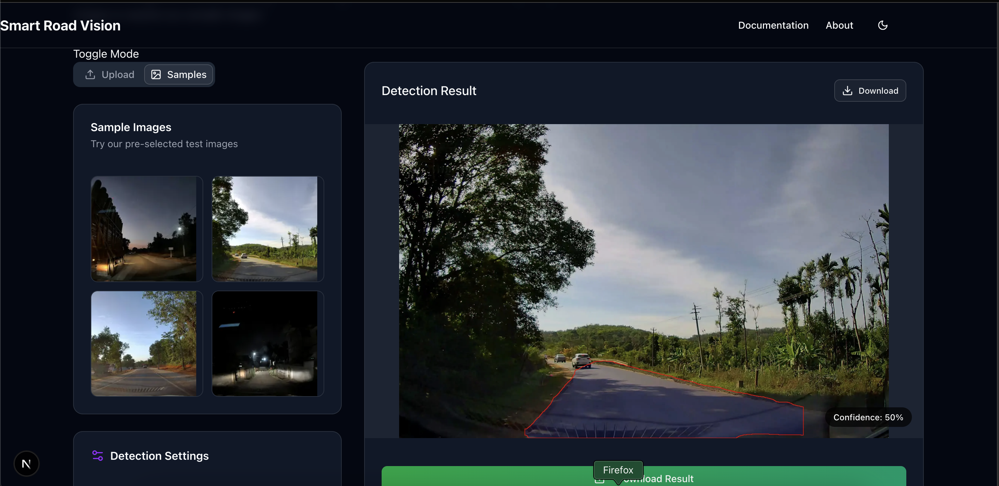

# 🚀 Road Boundary Detection  

This is a **Next.js** project bootstrapped with `create-next-app`. The project aims to detect unmarked road boundaries using **YOLO-based segmentation models**. The models have been trained using the Python files available in the following GitHub repository:  

 **GitHub Repository**: [Road Boundary Detection](https://github.com/paritoshkumar169/Road-boundary-detection)  
**Live Deployment**: [Vercel Link](https://road-boundary-ui.vercel.app/)  

##  UI Preview  

  

---

##  Getting Started  

To set up the project locally, follow these steps:  

1. Clone the repository:  
   ```bash
   git clone https://github.com/your-repository/road-boundary-ui.git
   cd road-boundary-ui
🛠️ Training Your Own Model
If you want to train your own YOLO models, refer to the Python files available in the repository mentioned above.

📌 Future Scope of Improvement
Backend Deployment: Setting up a Python environment on a hosted backend to avoid errors and improve model execution.

Better API Handling: Enhancing API request management for smoother performance and reduced latency.

 Project Status
Running the project locally produced results that were satisfying and close to self-annotations.

The YOLO-based segmentation models successfully detect unmarked road boundaries in daytime conditions.

🎨 Fonts & Styling
This project uses next/font to automatically optimize and load Geist, a modern font family for Vercel.

